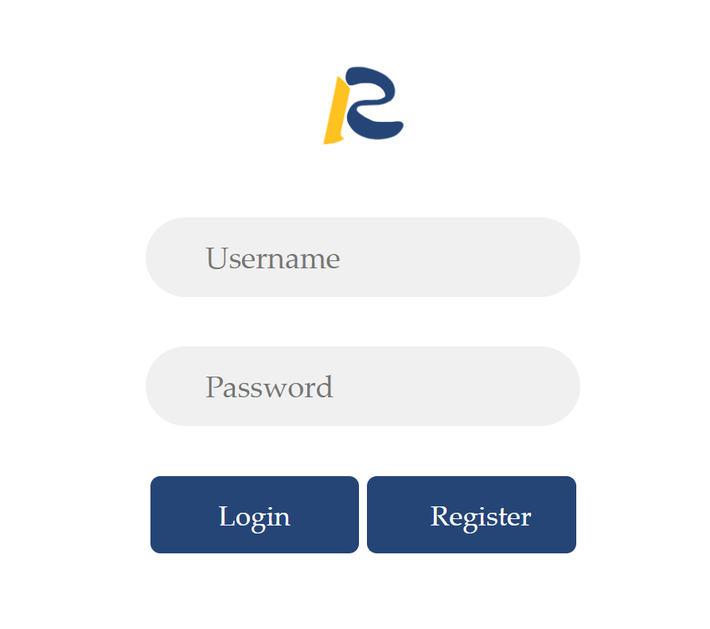
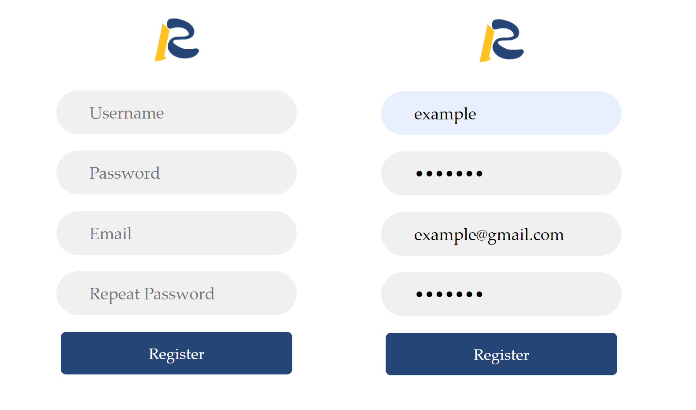
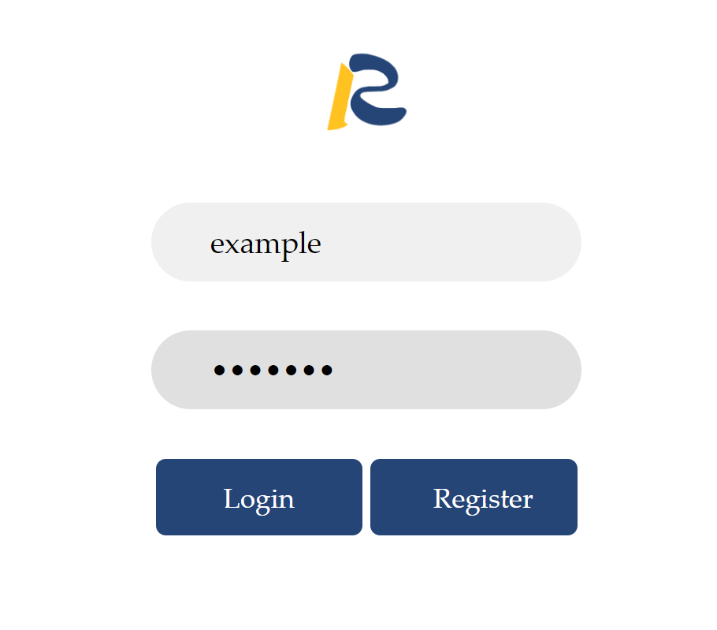

# Login LocalShiny Web

LocalShiny Web is a platform hosting Shiny apps. If you want to deploy your apps to the cloud, you need to login it first.

## 1.1 create an account

The first time you sign in, LocalShiny prompts you to sign up for a LocalShiny account.

1) In the upper-right corner of any page, click log in, then click register.

2) Register a new account using your username, password, and email address. Password is six or more characters, with no spaces. Then verify your email address. This verification allows you to retrieve your username or reset your password.

## 1.2 login your account

The user needs to log in by clicking ‘login' link at the top-right corner of the page.

