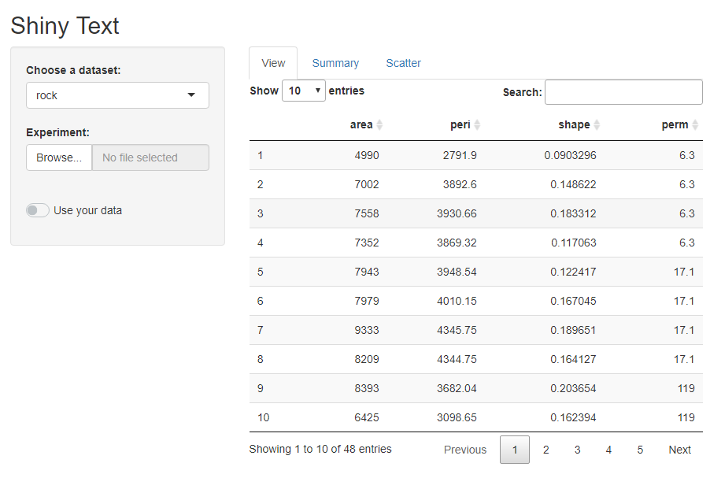
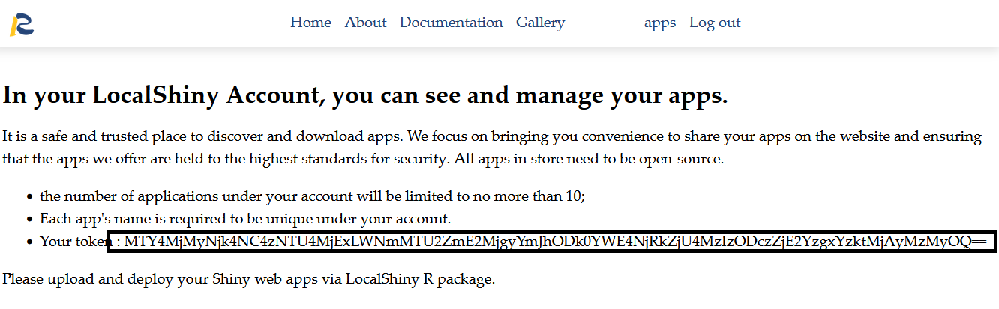
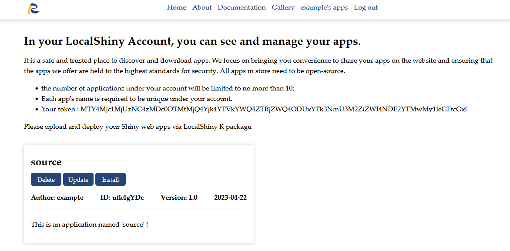
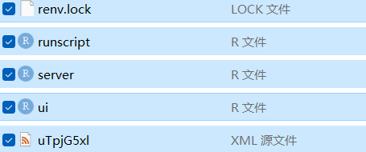

# Deploy Applications
The most suggested method uses the R package LocalShiny to deploy Shiny web apps.

## 3.1 Prepare a shiny app that works

### server.R
```r
# Obtain variables in the dataset
get_numeric_variable1 <- function(dt){
  return(colnames(dplyr::select_if(get(dt), is.numeric)))
}
# Obtain variables from user data
get_numeric_variable <- function(dt){
  return(colnames(dplyr::select_if(dt, is.numeric)))
}

server <- function(input, output) {
  # Return the input dataset ----
  read.d1 <- reactive({
    if (is.null(inFile1)) return(NULL)
    return(fread(inFile1$datapath))
    })
  
  # Return the requested dataset ----
  datasetInput <- reactive({inFile1 <- input$data_input1 
  if (is.null(inFile1)|| input$Id026==FALSE){{
    switch(input$dataset,
           "rock" = rock,
           "pressure" = pressure,
           "cars" = cars
           )}}
  else{read.csv(inFile1$datapath)}})
 
  # Return data's variables ----
  varis<-reactive({inFile1 <- input$data_input1
  if (is.null(inFile1)|| input$Id026==FALSE){
    get_numeric_variable1(input$dataset)
    }
  else{
    get_numeric_variable(data.frame(datasetInput()))
    }})
  
  # Return the requested x variable ----
  output$vx <- renderUI({selectInput('x', 'Select the X Variable: ', choices = varis())
    })
  
  # Return the requested y variable ----
  output$vy <- renderUI({selectInput('y', 'Select the Y Variable: ', choices = setdiff(varis(),input$x))
    })
  
  # Generate a summary of the dataset ----
  output$summary <- renderPrint({dataset <- datasetInput();summary(dataset)})
  
  output$scatterplot <- renderPlotly({
    ggplot(data = datasetInput(), aes_string(x = input$x, y = input$y)) +geom_point()
  })
  
  # Show the dataset ----
  output$view <- renderDT({data<-datasetInput()})
  }

```

### ui.R

```r
library(shinyWidgets)
library(ggplot2)
library(plotly)
library(DT)

ui <- fluidPage(
  # App title ----
  titlePanel("Shiny Text"),
  sidebarLayout(
    # Sidebar panel for inputs ----
    sidebarPanel(
      # Input: Selector for choosing dataset ----
      selectInput(inputId = "dataset",
                  label = "Choose a dataset:",
                  choices = c("rock", "pressure", "cars")
                  ),
      fileInput("data_input1", "Experiment:", accept = ".csv"),
      # Switch: Whether use own data ----
      prettySwitch(
        inputId = "Id026",
        label = "Use your data",
        value=FALSE
        ), 
      ),
    # mainPanel: Show the result ----
    mainPanel(
      # tabsetPanel: Each tab implements one function ----
      tabsetPanel(id='tabs',
                  # View : View data ----
                  tabPanel('View',value='view',
                           dataTableOutput("view")),
                  # Summary : The Summary of data ----
                  tabPanel('Summary',value='summary',
                           verbatimTextOutput("summary")),
                  # Scatter : Scatterplot between two variables ----
                  tabPanel("Scatter",value='scatter',
                           wellPanel(fluidRow(
                             column(3,uiOutput('vx')),
                             column(3,uiOutput('vy')),
                             )),
                           plotlyOutput("scatterplot")),
                  )
      )
    )
  )

```
Test that your application works by running it locally. Set your working directory to your app directory, and then run:

```r
library(shiny)
runApp()
```


If the app works, let's upload it to the LocalShiny web.

3.2 Configure LocalShiny package
After successful installation of the package, configure it to access your account before you deploy applications to the cloud. Once you set up an account in LocalShiny web, the database will automatically generate a contiguous sequence of characters as a token used to authorize your account. The token is listed on your account profile.



You can copy the token and use LocalShiny::login() to configure the package.

```
# copy the token then paste it into the R console. 
LocalShiny::login("example",token=" MTY4MjMyNjk4NC4zNTU4MjExLWNmMTU2ZmE2MjgyYmJhODk0YWE4NjRkZjU4MzIzODczZjE2YzgxYzktMjAyMzMyOQ==")
```

## 3.3 Deploy applications

Once you have configured the LocalShiny R package, you can use the function LocalShiny::deployApp() to upload Shiny apps under your account. In this function, the state of a project's R package dependencies will be captured and stored in a lock file. This lock file will be uploaded together with all the other application files.

If upload is "TRUE", then the package will be uploaded to server, so that users can download it from the website.

```r
# use deplpyApp() to distribute an app named "source"
#"path_shiny" is set as your app directory, it can be a file as well.

LocalShiny::deployApp(username="example", project="path_shiny", name="source" ,upload=TRUE)
```
Congratulations! You've deployed your app named "source", and upload it to the website. 


If upload is "FALSE", your app will not be uploaded to server, and you will get a zip in your app directory which contains R file, lock file and xml file, which can be used to install the package in Localshiny Application ([install from local](#jump)).

```r
LocalShiny::deployApp(username="example", project="path_shiny", name="source" ,upload=FALSE)
```
Congratulations! You've deployed your app named "source", and save it locally. 
