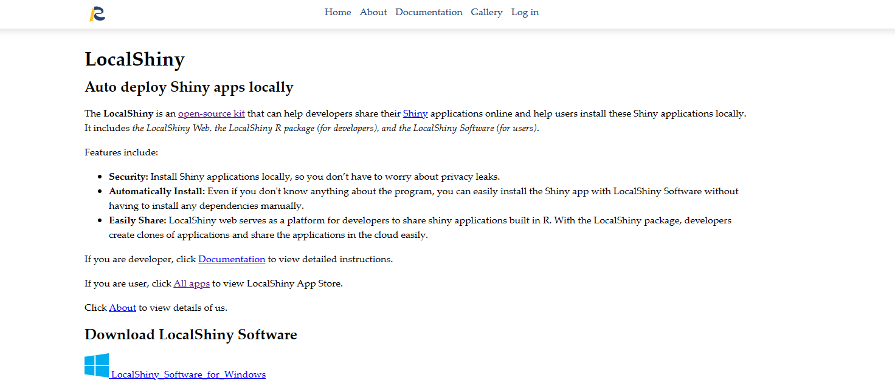

# Install LocalShiny Software
You can install LocalShiny software on supported Windows (7 64-bit or later).

1. Visit the download page for LocalShiny software, and select the operating system your machine support to download LocalShiny software. 

2. In your computer's downloading folder, double-click the LocalShiny software installation package.

3. After installing the software following the steps of the installation package, a LocalShiny software shortcut will be automatically generated on the desktop.

4. LocalShiny software will launch after double-clicking the shortcut. The LocalShiny web is embed within app window. The console window in the right panel is the place where R displays the progress or reports back the exact errors or behaviors as apps install or run. You cannot type commands directly into the console.
