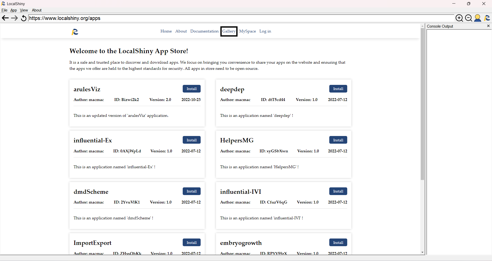
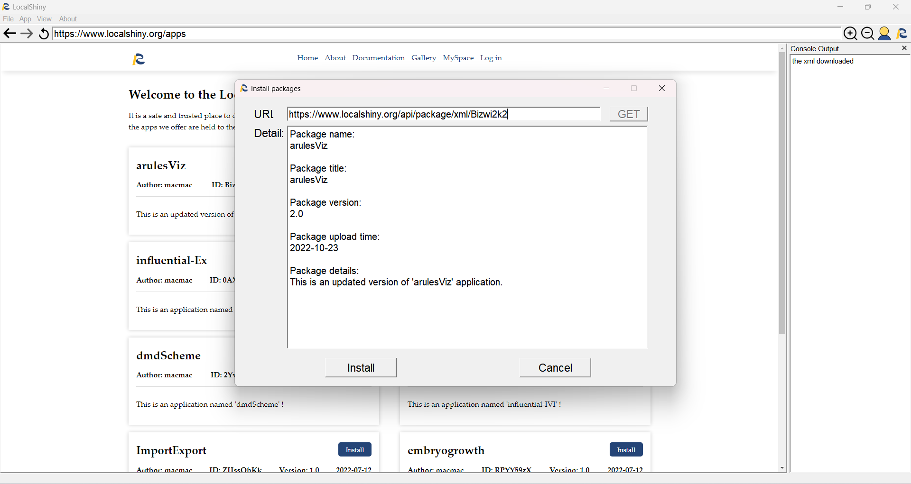
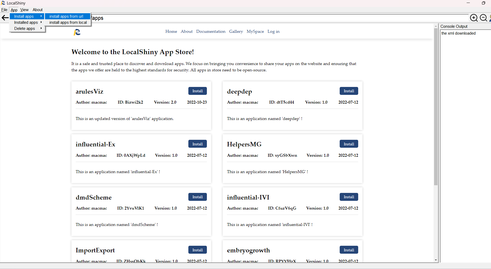
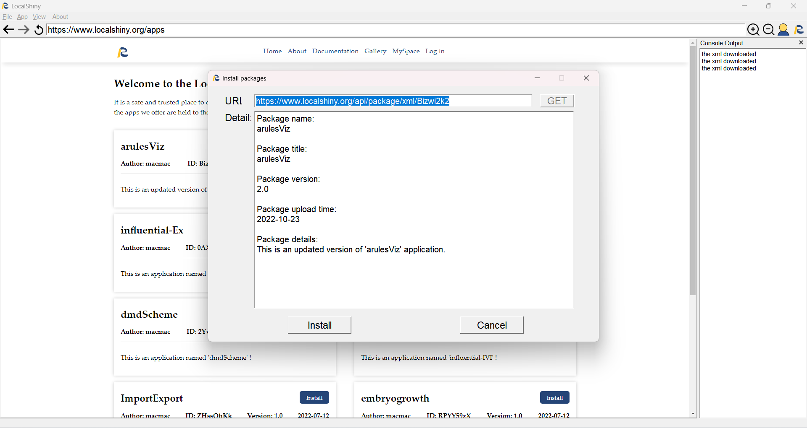
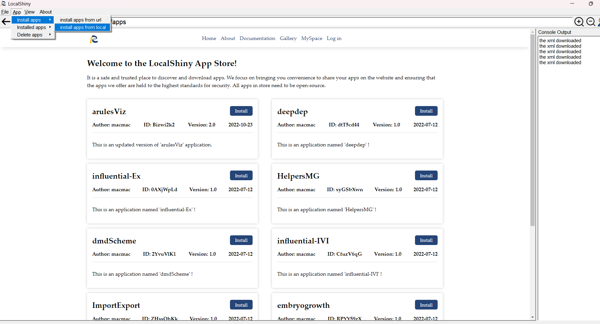
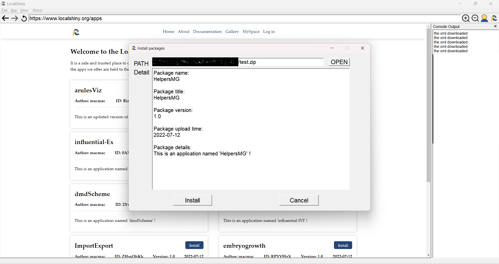

# Install Shiny Applications

LocalShiny software automates the process of installing shiny apps. You can install Shiny apps with only one click.

LocalShiny provide three methods for users to install apps,install from LocalShiny Web, install from url and install from local.

## Method 1:This method is suitable for users who have the desired app in the gallery.

Clicking Gallery to go to the app store, where all Shiny apps hosted on our web are listed.

Select Shiny apps of interest and click Install to access more information about the apps you choose. A window will pop up that shows full information about the app. After that, click Install or Cancel to continue to install apps or abort the installation.

## Method 2:This method is suitable for users who know the url of the APP's configuration package.

Clicking the button App. Then go to Intall apps, scroll down to the install apps from url, and click on it.

Enter the URL in the pop-up window,Then click get,the information will be listed. After that, click Install or Cancel to continue to install apps or abort the installation. 

## Method 3:This method is suitable for users who have downloaded APP's configuration package locally.

Clicking the button App. Then go to Intall apps, scroll down to the install apps from local, and click on it.

Clicking Open to Select the directory where the package is located,the information will be listed. After that, click Install or Cancel to continue to install apps or abort the installation. 

