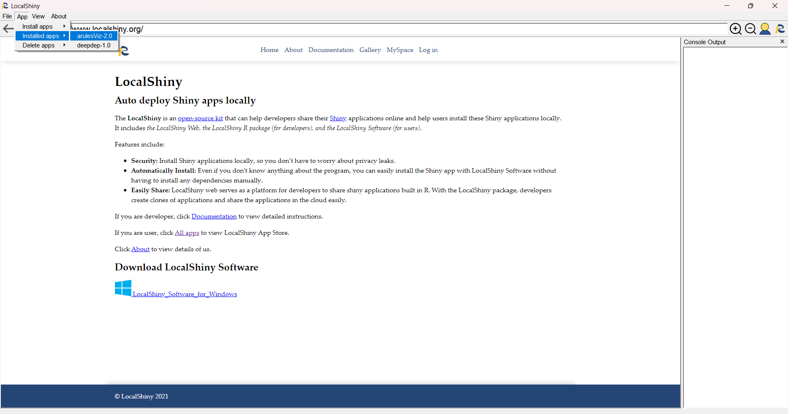
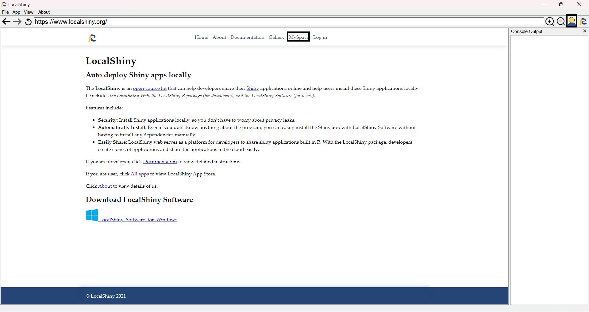
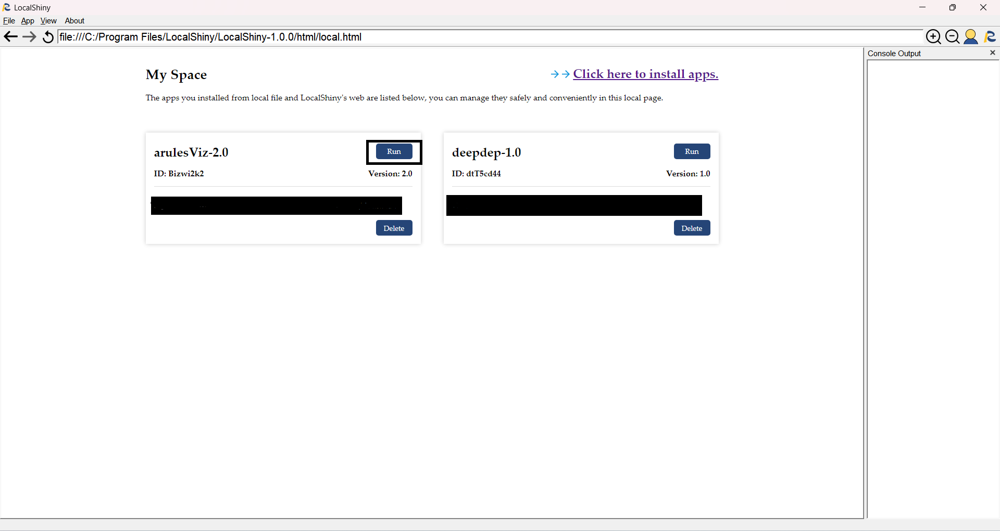
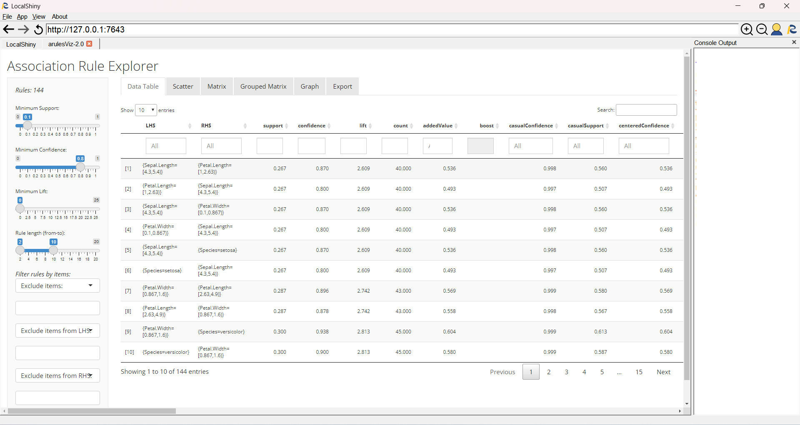

# Run Shiny Applications

After successful installation, the new project will appear in the list of installed apps. 

LocalShiny provide two methods for users to run apps,run apps by menu and run apps by MySpace.

Method 1:You can run an app on your computer by clicking the button App. Then go to Intalled apps, scroll down to the app you wish to run, and click on it.

Method 2:You can run an app on your computer by clicking it in MySpace.First, go to MySpace by clicking "MySpace" link or "MySpace" icon.

Then select the APP you want to run, and click run button of it.

When applications are running, they are displayed in a browser window embed within your app window. Meanwhile, notice that a sign, "listening on …", appears in the Console window while your app is running, indicating the current R session is busy running your application.

Now we have a running application.

