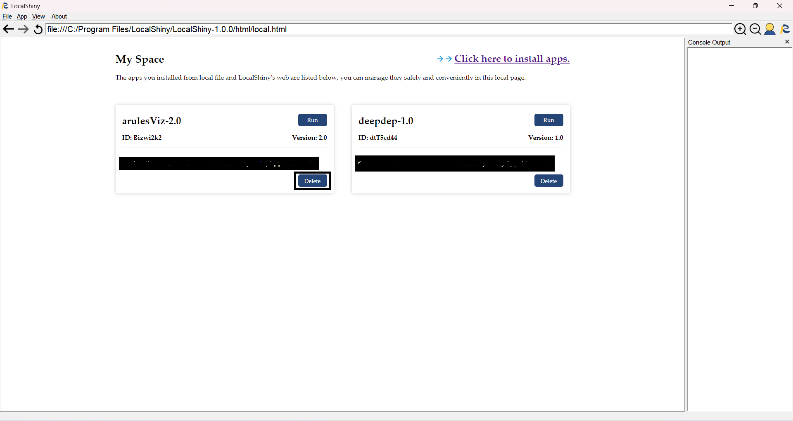

# Delete Shiny Applications

You can also manage installed apps on your local machine.
LocalShiny provide two methods for users to delete apps,delete apps by menu and run apps by MySpace.

## Method 1:Delete app by menu
You can delete an app on your computer by clicking the button App. Then go to Delete apps, scroll down to the app you wish to remove, and click it. 

## Method 2:Delete app by MySpace
You can delete an app on your computer by the "Delete" button in MySpace. 

A prompt box will pop up to confirm whether you want to delete the app, if you confirm, click Yes, otherwise click No.

